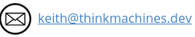

# breaking_bad_text

 This is a short Python programme that takes some input text (a list of strings) and formats the text to look like the title sequence of the TV series Breaking Bad.

 

 

The python programme has a list of chemical elements. It breaks down the input text into:

`individual lines > words > characters`

It uses the characters as search terms to search the  elements list for matches and then changes the formatting for those characters. There are rules to prioritise two letter over one letter matches and unused over previously used matches. 

The order in which the words are used is randomised to stop the changes being biased towards the start of the line of text.

There is a list of words to ignore, for example prepositions, conjunctions, but also verbs and job titles. This keeps the example text looking like the real thing. 

#### Installation

Clone from: `git@github.com:keith-taylor/breaking_bad_text.git`

#### Contact

 `@_thinkmachines_`

 https://github.com/keith-taylor 

 

 

